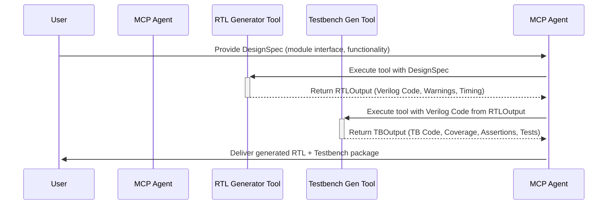
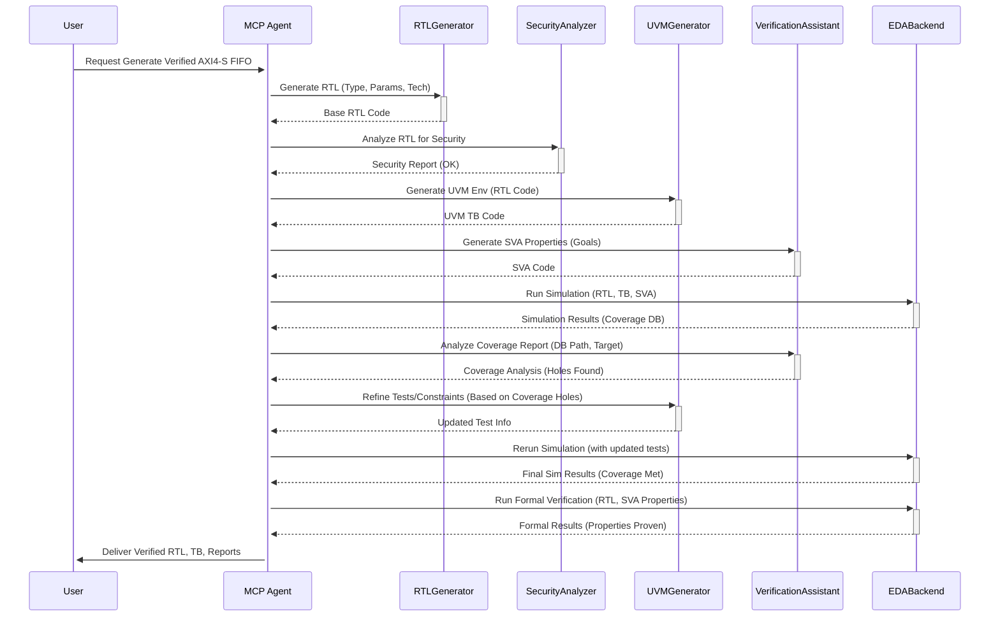

# Verilog MCP Agent Concept

This document outlines a concept for an MCP-based system for Verilog/SystemVerilog RTL design and verification.

## Tool 1: Intelligent Verilog Designer (`rtl_gen`)

Generates synthesizable SystemVerilog RTL based on a design specification.

### MCP Tool Definition (Conceptual)

```systemverilog
class RTLDesigner extends MCPTool;
  // Input Parameters
  typedef struct {
    string module_name;
    struct {string name; logic[31:0] width; string dir;} ports[$];
    struct {string name; int value;} params[$];
    string clk_reset_scheme = "posedge clk, async reset_n";
    string functionality; // e.g., "pipeline", "fsm", "fifo"
  } DesignSpec;

  // Output Structure
  typedef struct {
    string verilog_code;
    string warnings;
    struct {string constraint; string description;} timing_exceptions[$];
  } RTLOutput;

  function RTLOutput execute(DesignSpec spec);
    // Generate synthesizable RTL with industry best practices
    string code;

    // Header generation
    code = $sformatf("module %s (\n", spec.module_name);
    foreach(spec.ports[i])
      code = {code, $sformatf("  %-6s %s%s%s\n",
               spec.ports[i].dir,
               (spec.ports[i].width > 1) ? $sformatf("[%0d:0] ", spec.ports[i].width-1) : "",
               spec.ports[i].name,
               (i == spec.ports.size()-1) ? "" : ",")};
    code = {code, ");\n\n"};

    // Parameter handling
    if (spec.params.size() > 0) begin
        code = {code, "#(\n"};
        foreach(spec.params[i])
          code = {code, $sformatf("  parameter %s = %0d%s\n",
                   spec.params[i].name, spec.params[i].value,
                   (i == spec.params.size()-1) ? "" : ",")};
        code = {code, ") (\n"}; // Re-open ports list if params exist
        foreach(spec.ports[i])
          code = {code, $sformatf("  %-6s %s%s%s\n",
                   spec.ports[i].dir,
                   (spec.ports[i].width > 1) ? $sformatf("[%0d:0] ", spec.ports[i].width-1) : "",
                   spec.ports[i].name,
                   (i == spec.ports.size()-1) ? "" : ",")};
        code = {code, ");\n\n"};
    end

    // Functional implementation (Example stubs)
    code = {code, $sformatf("  // Clock and Reset Scheme: %s\n", spec.clk_reset_scheme)};
    case(spec.functionality)
      "pipeline": code = {code, "  // Pipeline logic generation stub\n"};
      "fsm":      code = {code, "  // FSM logic generation stub\n"};
      "fifo":     code = {code, "  // FIFO logic generation stub\n"};
      default:    code = {code, "  // Custom logic implementation based on description\n"};
    endcase

    code = {code, "endmodule\n"};

    // Post-processing (Example stubs)
    string warnings_found = "// check_coding_guidelines stub";
    // timing_exceptions = extract_timing_constraints(code);

    return '{verilog_code: code,
             warnings: warnings_found,
             timing_exceptions: '{} }; // Placeholder
  endfunction
endclass
```

## Tool 2: AutoTB Generator (`tb_gen`)

Generates a UVM-style testbench based on input Verilog code.

### MCP Tool Definition (Conceptual)

```systemverilog
class TBGenerator extends MCPTool;
  // Input: Verilog code string from rtl_gen
  // Output: Complete UVM-style testbench components

  typedef struct {
    string module_name;
    string clk;
    // Add other parsed interface details as needed
    int complexity_score; // Example metric
  } ModuleInterface; // Simplified representation

  typedef struct {
    string tb_code;
    string coverage_model;
    string assertion_pkg;
    string test_cases[$];
  } TBOutput;

  // Placeholder function for parsing
  function ModuleInterface parse_module_interface(string verilog_code);
      // Basic parsing logic to extract module name, clock, etc.
      // This would need a more robust parser in reality.
      string name = "parsed_module";
      string clock_name = "clk";
      // Extract name and clock using regex or more advanced parsing
      // ...
      return '{module_name: name, clk: clock_name, complexity_score: 60};
  endfunction

  function TBOutput execute(string verilog_code);
    TBOutput tb;

    // Parse RTL interface
    ModuleInterface ifc = parse_module_interface(verilog_code);

    // Generate testbench skeleton
    tb.tb_code = $sformatf(
      "`timescale 1ns/1ps\n\n"
      "module %s_tb;\n"
      "  logic %s;\n"  // Clock generation
      "  // Interface signals based on parsed IFC\n"
      "  // ...\n\n"
      "  %s dut (.*);\n\n"  // DUT instantiation
      "  initial begin\n"
      "    %s = 0;\n"
      "    forever #5 %s = ~%s;\n" // Simple clock toggle
      "  end\n\n"
      "  initial begin\n"
      "    $dumpfile(\"waves.vcd\");\n"
      "    $dumpvars(0, %s_tb);\n"
      "    // Basic reset sequence\n"
      "    // ...\n"
      "    #100 $finish;\n"
      "  end\n"
      "endmodule\n",
      ifc.module_name, ifc.clk, ifc.module_name,
      ifc.clk, ifc.clk, ifc.clk, // Clock generation
      ifc.module_name
    );

    // Add UVM components (Conditional example)
    if(ifc.complexity_score > 50) begin
      tb.tb_code = {tb.tb_code,
        "\n`include \"uvm_macros.svh\"\n"
        "import uvm_pkg::*;\n\n"
        "// Basic UVM Test Structure\n"
        "class %s_test extends uvm_test;\n"
        "  `uvm_component_utils(%s_test)\n"
        "  // Add env, sequences etc.\n"
        "  function new(string name = \"%s_test\", uvm_component parent = null);\n"
        "    super.new(name, parent);\n"
        "  endfunction\n"
        "  // build_phase, run_phase etc.\n"
        "endclass\n", ifc.module_name, ifc.module_name, ifc.module_name};
    end

    // Generate functional coverage (Stub)
    tb.coverage_model = "// generate_covergroups stub based on ifc";

    // Create assertions (Stub)
    tb.assertion_pkg = "// generate_sva_assertions stub based on ifc";

    // Generate test scenarios (Stub)
    tb.test_cases = {"// Test case 1: Basic reset", "// Test case 2: Data transfer"};

    return tb;
  endfunction
endclass
```

## MCP Integration Workflow Example

Illustrates how a client might use the `rtl_gen` and `tb_gen` tools.

```systemverilog
// Client-side usage example (Conceptual)
module mcp_client;
  initial begin
    // Step 1: Define Design Specification
    RTLDesigner::DesignSpec spec = '{
      module_name: "my_fifo",
      ports: '{
        '{name: "clk", width:1, dir:"input"},
        '{name: "rst_n", width:1, dir:"input"},
        '{name: "wr_en", width:1, dir:"input"},
        '{name: "rd_en", width:1, dir:"input"},
        '{name: "data_in", width:32, dir:"input"},
        '{name: "data_out", width:32, dir:"output"},
        '{name: "full", width:1, dir:"output"},
        '{name: "empty", width:1, dir:"output"}
      },
      params: '{ '{name:"DEPTH", value:16} },
      functionality: "fifo"
    };

    // Step 2: Generate RTL using MCP Tool
    // Assume mcp_execute is a function handling MCP communication
    RTLDesigner::RTLOutput rtl = mcp_execute("rtl_gen", spec);
    $display("Generated RTL:\n%s", rtl.verilog_code);
    if (rtl.warnings != "") $display("Warnings:\n%s", rtl.warnings);

    // Step 3: Generate Testbench from RTL using MCP Tool
    TBGenerator::TBOutput tb = mcp_execute("tb_gen", rtl.verilog_code);
    $display("Generated Testbench Code:\n%s", tb.tb_code);
    $display("Generated Coverage Model:\n%s", tb.coverage_model);
    $display("Generated Assertions:\n%s", tb.assertion_pkg);

    // Step 4: Save generated files (Example using system calls)
    $system($sformatf("echo '%s' > %s.sv", rtl.verilog_code, spec.module_name));
    $system($sformatf("echo '%s' > %s_tb.sv", tb.tb_code, spec.module_name));
    // Save other outputs like coverage, assertions etc.
  end
endmodule
```

## Key Features (Conceptual)

### RTL Designer (`rtl_gen`) Features

*   **Architectural Best Practices:**
    *   Generates safe FSM templates.
      ```systemverilog
      // Example: Safe FSM template
      typedef enum logic [1:0] {IDLE, START, DATA, DONE} state_t;
      state_t current_state, next_state;

      always_ff @(posedge clk or negedge rst_n) begin
        if(!rst_n) current_state <= IDLE;
        else       current_state <= next_state;
      end

      always_comb begin
        next_state = current_state; // Default assignment
        case(current_state)
          IDLE: // ...
          // ...
          default: next_state = IDLE; // Safe default
        endcase
      end
      ```
*   **CDC Handling:**
    *   Automatically inserts synchronizers for signals crossing clock domains (based on analysis).
    *   Generates basic clock constraint SDC files.
*   **Technology Mapping:**
    *   Can optimize generated RTL for specific target technologies (e.g., FPGA families).
      ```systemverilog
      // Example: Technology-specific FIFO generation
      if(target_tech == "XILINX_US+") begin
        // Instantiate Xilinx UltraScale+ optimized BRAM FIFO primitive
        generate_xilinx_bram_fifo(.true_dual_port(1));
      end else begin
        // Generate generic register-based FIFO
        generate_generic_fifo();
      end
      ```

### TB Generator (`tb_gen`) Features

*   **Verification Intelligence:**
    *   Performs automatic interface analysis to generate corresponding UVM components (drivers, monitors, agents).
      ```systemverilog
      // Example: Generated virtual interface and clocking block
      interface fifo_if(input logic clk, input logic rst_n);
        logic wr_en;
        logic rd_en;
        logic [31:0] data_in;
        logic [31:0] data_out;
        logic full;
        logic empty;

        clocking driver_cb @(posedge clk);
          output wr_en, rd_en, data_in;
          input data_out, full, empty;
        endclocking

        clocking monitor_cb @(posedge clk);
          input wr_en, rd_en, data_in, data_out, full, empty;
        endclocking
        // Modports...
      endinterface
      ```
    *   Generates constrained random test sequences.
      ```systemverilog
      // Example: Constrained random sequence item
      class fifo_sequence_item extends uvm_sequence_item;
        rand logic [31:0] data;
        rand logic wr;
        rand logic rd;

        constraint valid_op { wr != rd; } // Example constraint
        constraint valid_data { data inside {[0:100]}; }

        `uvm_object_utils_begin(fifo_sequence_item)
          `uvm_field_int(data, UVM_ALL_ON)
          `uvm_field_int(wr, UVM_ALL_ON)
          `uvm_field_int(rd, UVM_ALL_ON)
        `uvm_object_utils_end

        // new function etc.
      endclass
      ```
*   **Coverage-Driven Verification:**
    *   Generates functional coverage models (covergroups) based on the interface and design specification.
      ```systemverilog
      // Example: Generated covergroup
      covergroup fifo_cov with function sample(logic [31:0] data_in, logic full, logic empty);
        option.per_instance = 1;
        cp_data_range : coverpoint data_in {
          bins low = {[0:100]};
          bins mid = {[101:1000]};
          bins high = {[1001:$]};
        }
        cp_status : cross full, empty;
      endgroup
      ```
*   **Formal Assertions:**
    *   Generates SystemVerilog Assertions (SVA) based on the RTL structure and common properties (e.g., FIFO not full when writing).
      ```systemverilog
      // Example: Automatically generated assertion
      property p_write_not_full;
        @(posedge clk) disable iff (!rst_n)
        (wr_en && !full); // Simple example: write should only happen when not full
      endproperty
      a_write_not_full: assert property (p_write_not_full);
      ```

## Tool Interaction Diagram



---

# Verilog MCP Agent Architecture (Extended Concept)

This section describes a more comprehensive agent architecture built upon the core tools.

*   **Focus:** ASIC/FPGA RTL Design, Verification, CDC Analysis, UPF Power Intent

## 1. Core Capabilities

### 1.1 Hardware Understanding Engine

*   Maintains knowledge of SystemVerilog constructs, synthesizability rules, and best practices.

```systemverilog
class HDLKnowledgeBase extends MCPTool;
  // Contains knowledge about IEEE 1800 constructs, synthesis rules, etc.
  string[] supported_constructs = {
    "SystemVerilog Interfaces",
    "Assertion-based verification (SVA)",
    "Coverage-driven verification (Covergroups)",
    "Constrained Randomization",
    "UPF 3.1 Power Intent"
    // ... more constructs
  };

  function bit is_synthesizable(string code_snippet, string target_tech);
    // Uses rules and potentially ML models to check synthesizability
    // Returns 1 if likely synthesizable, 0 otherwise
    // ... implementation stub ...
    return 1;
  endfunction

  function string get_best_practice(string construct_type);
    // Returns recommended coding style or pattern
    // ... implementation stub ...
    return "// Best practice recommendation stub";
  endfunction
endclass
```

### 1.2 Advanced Code Analysis

*   Performs static and dynamic analysis on Verilog/SystemVerilog code.

```systemverilog
class RTLAnalyzer extends MCPTool;
  // Input: HDL code, target technology, analysis options
  // Output: Reports (CDC, Lint, Complexity, Guideline adherence)

  typedef struct {
    string cdc_report;
    string lint_report;
    string complexity_metrics;
    string guideline_violations;
  } AnalysisResult;

  task execute(input string hdl_code, input string target_tech);
    AnalysisResult result;
    // Static checks
    result.cdc_report = check_clock_domain_crossing(hdl_code);
    result.lint_report = run_linting_checks(hdl_code);
    // analyze_fsm_states(hdl_code);
    // detect_unreachable_logic(hdl_code);

    // Metrics
    result.complexity_metrics = generate_complexity_report(hdl_code);
    // result.guideline_violations = check_vendor_guidelines(hdl_code, target_tech); // e.g., AMD/Xilinx Versal

    // Return result (mechanism TBD, e.g., via MCP resource or direct output)
    // ...
  endtask

  // Placeholder functions for analysis steps
  function string check_clock_domain_crossing(string code); return "// CDC report stub"; endfunction
  function string run_linting_checks(string code); return "// Lint report stub"; endfunction
  function string generate_complexity_report(string code); return "// Complexity report stub"; endfunction

endclass
```

## 2. Tool Integration Layer

### 2.1 EDA Tool Interface

*   Provides an abstraction layer to interact with standard EDA tools (Simulators, Formal Tools, Synthesis).

```systemverilog
class EDABackend extends MCPTool;
  // Input: Command type (sim, formal, synth), design files, options
  // Output: Tool log, results (pass/fail, coverage db, netlist)

  virtual task run_simulation(string design_files[], string top_module, string options);
    // Abstracts vendor simulators (VCS, Questa, Xcelium)
    string cmd = $sformatf("vcs -sverilog %s -top %s %s +define+COVERAGE_ENABLE", join(design_files," "), top_module, options);
    // execute_shell(cmd); // Conceptual shell execution
    $display("Executing Simulation: %s", cmd);
    // Capture and return results
  endtask

  virtual task run_formal_verification(string design_files[], string properties_file);
    // Abstracts formal tools (JasperGold, Questa Formal, VC Formal)
    string cmd = $sformatf("jaspergold -tcl prove_properties.tcl %s %s", join(design_files," "), properties_file);
    // execute_shell(cmd);
    $display("Executing Formal Verification: %s", cmd);
    // Capture and return results
  endtask

   virtual task run_synthesis(string design_files[], string top_module, string constraints_file, string target_tech);
    // Abstracts synthesis tools (Design Compiler, Vivado Synth, Quartus Synth)
    string cmd = $sformatf("dc_shell -f run_synth.tcl %s %s %s %s", top_module, join(design_files," "), constraints_file, target_tech);
    // execute_shell(cmd);
    $display("Executing Synthesis: %s", cmd);
    // Capture and return results (netlist, reports)
  endtask

endclass
```

### 2.2 Modern Verification Flow

*   Orchestrates UVM environment generation and test execution.

```systemverilog
class UVMGenerator extends MCPTool;
  // Leverages tb_gen and potentially other tools

  function void generate_uvm_environment(string rtl_code, string interface_name);
    // Creates complete UVM environment structure
    // create_uvm_agent(interface_name);
    // generate_sequence_items();
    // build_coverage_model();
    // create_base_test();
    $display("Generating UVM Environment for interface: %s", interface_name);
    // ... implementation stub ...
  endfunction

  task run_uvm_tests(string test_names[]);
    // Compiles environment and runs specified UVM tests using EDABackend
    $display("Running UVM Tests: %s", join(test_names, ", "));
    // ... implementation stub ...
  endtask

endclass
```

## 3. Knowledge Base Structure

*   Stores design patterns, optimization techniques, common bugs, and vendor-specific information.

```systemverilog
class HDLKnowledgeGraph extends MCPTool;
  // Represents a structured knowledge base, potentially using graph DB concepts

  // Example Data Structures (Conceptual)
  typedef struct {
    string pattern_name;
    string description;
    string code_example;
    string applicability; // e.g., "CDC", "Low Power"
  } DesignPattern;

  typedef struct {
    string bug_name;
    string description;
    string symptom;
    string fix_suggestion;
    string related_constructs[];
  } CommonBug;

  DesignPattern patterns[$];
  CommonBug bugs[$];
  // Add vendor-specific optimizations, guidelines etc.

  function void load_knowledge();
    // Load data from external sources or internal definitions
    patterns.push_back('{pattern_name:"2-FF Synchronizer", description:"Standard CDC synchronizer", ...});
    bugs.push_back('{bug_name:"Simulation-Synthesis Mismatch", description:"Behavior differs...", ...});
    // ...
  endfunction

  function DesignPattern find_pattern(string query);
    // Search for relevant design patterns
    // ... implementation stub ...
    return patterns[0]; // Placeholder
  endfunction

  function CommonBug find_bug(string query);
    // Search for known bugs based on symptoms or code constructs
    // ... implementation stub ...
    return bugs[0]; // Placeholder
  endfunction

endclass
```

## 4. Code Generation Engine

### 4.1 Intelligent RTL Generator

*   Extends the basic `rtl_gen` with more sophisticated generation capabilities based on high-level descriptions and knowledge base.

```systemverilog
class RTLGenerator extends MCPTool; // Potentially inherits from or uses RTLDesigner
  // Input: High-level spec (e.g., "AXI4-Stream FIFO", width, depth, target_tech)
  // Output: Optimized Verilog/SystemVerilog code

  function string generate_module(string module_type, string params[$], string target_tech);
    string generated_code;
    // Access HDLKnowledgeGraph for optimal implementation based on type and tech
    case(module_type)
      "fifo": generated_code = generate_fifo(params["width"], params["depth"], params["implementation"], target_tech);
      "arbitrer": generated_code = generate_arbitrer(params["num_inputs"], params["scheme"]);
      // ... other module types
      default: generated_code = "// Unsupported module type";
    endcase
    return generated_code;
  endfunction

  // Example internal generator function
  function string generate_fifo(int width, int depth, string impl, string tech);
    string code;
    $display("Generating FIFO: Width=%0d, Depth=%0d, Impl=%s, Tech=%s", width, depth, impl, tech);
    // Logic to generate BRAM, LUT, or generic FIFO based on params
    // ... implementation stub ...
    code = "// FIFO Generation Stub";
    return code;
  endfunction

endclass
```

### 4.2 AI-Assisted Code Completion

*   Suggests code snippets based on context, potentially using fine-tuned LLMs.

```systemverilog
class AICodeComplete extends MCPTool;
  // Input: Partial code snippet, design context (module type, surrounding code)
  // Output: Suggested code completions

  function string suggest_code(string partial_code, string design_context);
    string suggestion;
    // Uses fine-tuned model (e.g., CodeLlama, StarCoder) trained on Verilog/SV
    // suggestion = ai_model.predict(partial_code, design_context);
    $display("AI Suggestion for: %s", partial_code);
    suggestion = "// AI code suggestion stub"; // Placeholder
    return suggestion;
  endfunction
endclass
```

## 5. Verification Assistant

*   Helps in writing assertions, coverage points, and analyzing verification results.

```systemverilog
class VerificationAssistant extends MCPTool;

  function string generate_sva_property(string requirement_description);
    // Translates natural language requirement into SVA property
    string property_code;
    $display("Generating SVA for: %s", requirement_description);
    // property_code = nlp_to_sva_model.predict(requirement_description);
    property_code = "// assert property (@(posedge clk) req |=> ##[1:3] gnt);"; // Placeholder
    return property_code;
  endfunction

  function string suggest_coverpoint(string signal_name, string context);
    // Suggests relevant coverpoints and bins based on signal and context
    string covergroup_code;
    $display("Suggesting Coverpoint for: %s", signal_name);
    // covergroup_code = coverage_model.suggest(signal_name, context);
    covergroup_code = $sformatf("coverpoint %s { bins range = {[0:$]}; }", signal_name); // Placeholder
    return covergroup_code;
  endfunction

  task analyze_coverage_report(string coverage_db_path);
    // Analyzes coverage database to identify holes and suggest improvements
    $display("Analyzing Coverage: %s", coverage_db_path);
    // Identify uncovered bins/crosses
    // Suggest new constraints or test scenarios
    // ... implementation stub ...
  endtask

endclass
```

## 6. Security & Quality Checks

*   Focuses on identifying potential hardware security vulnerabilities and quality issues.

```systemverilog
class SecurityAnalyzer extends MCPTool;
  // Input: RTL code, potentially synthesis results or power data
  // Output: Security vulnerability report

  task check_hardware_security(string rtl_code);
    // Security-focused analysis
    // detect_information_leakage();
    // check_for_hardware_trojans_patterns(); // Based on known patterns
    // analyze_control_flow_integrity();
    // check_secure_boot_logic(); // If applicable
    $display("Running Hardware Security Checks...");
    // ... implementation stub ...
    string report = "// Security analysis report stub";
    $display("Security Report:\n%s", report);
  endtask

  task check_quality_metrics(string rtl_code);
    // Checks against quality standards (e.g., lint rules, complexity thresholds)
    $display("Running Quality Metric Checks...");
    // Reuse RTLAnalyzer or specific quality checks
    // ... implementation stub ...
    string report = "// Quality report stub";
    $display("Quality Report:\n%s", report);
  endtask

endclass
```

## Implementation Workflow (Agent Example)

Illustrates how the agent might handle a user request using multiple tools.

### User Request Example

```verilog
// User interacts with the MCP Agent, not directly with individual tools
mcp_agent.generate_verified_module({
  "module_type": "AXI4-Stream FIFO",
  "parameters": {
    "DATA_WIDTH": 64,
    "DEPTH": 256,
    "CDC_SCHEME": "ASYNC_FIFO_PTR", // More specific CDC requirement
    "TARGET_TECH": "Xilinx_UltraScale+"
  },
  "verification_goals": {
    "coverage_target": 95,
    "formal_properties": ["fifo_full_never_overflows", "fifo_empty_never_underflows"]
  }
});
```

### Agent Execution Flow



## Key Features (Agent Architecture)

*   **Modern Construct Support:**
    *   Parameterized interfaces with clocking blocks and modports.
    *   Assertion-based formal properties (SVA).
    *   UPF 3.1+ power intent generation/parsing.
    *   Advanced UVM features (sequences, virtual sequences, register model).
*   **Optimization Strategies:**
    *   Applies FPGA/ASIC-specific optimizations during RTL generation.
      ```systemverilog
      // Example: Agent applying optimization based on target
      agent.generate_module("FIR_Filter", {
        "TAPS": 128,
        "DATA_WIDTH": 16,
        "TARGET_ARCH": "Xilinx_UltraScale+",
        "OPT_STRATEGY": "DSP48E2_Pipelined" // Agent selects appropriate implementation
      });
      ```
*   **Verification CI/CD Integration:**
    *   Tools designed to be scriptable and integrated into CI/CD pipelines (e.g., GitLab CI, Jenkins).
      ```bash
      # Example CI/CD script commands (Conceptual)
      mcp_agent run_checks --module axi_crossbar --target vcs_sim --lint --cdc
      mcp_agent formal_verify --module axi_crossbar --property deadlock_free --tool jaspergold
      mcp_agent generate_coverage_report --results sim_results.db --format html